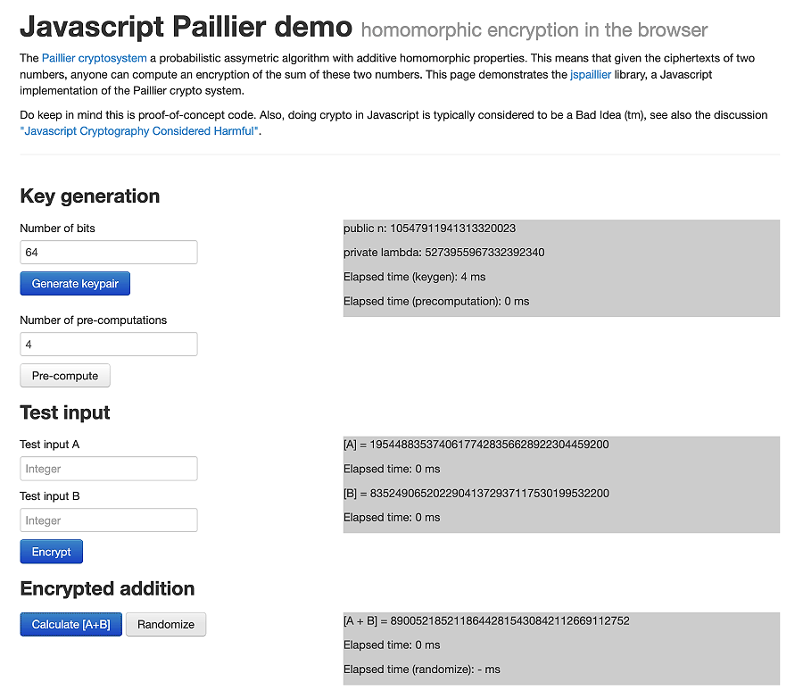

# Paillier Homomorphic Encryption Demo

**JavaScript implementation of the Paillier cryptography-system**.

**[andysign.github.io/paillier-h-encr-demo](https://andysign.github.io/paillier-h-encr-demo/)**

A simple _proof-of-concept_ implementation of the **[Paillier crypto-system](https://en.wikipedia.org/wiki/Paillier_cryptosystem)**. This cryptographic solution is a famous solution which came out of the renowned 1999 academic paper by _Pascal Paillier_ named **[Public-Key Cryptosystems Based on Composite Degree Residuosity Classes](https://link.springer.com/content/pdf/10.1007/3-540-48910-X_16.pdf)**. This paper introduces the _Paillier_ encryption system which supports **homomorphic encryption** addition of two encrypted numbers and, in addition to that, the scalar multiplication of a constant ( **homomorphic encryption** is a type of encryption that allows the user to perform operations on encrypted values and produce encrypted outputs in such a way so that the outputs, if decrypted will be equal to the output of the same set of operations performed on the un-encrypted values )

This is heavily inspired by the old 2014 repository **[github.com/mhe/jspaillier](https://github.com/mhe/jspaillier)**.

---

## Usage

In order to use this just spin up a Python Http Server ( from the **`./docs/`** folder ) and navigate to **[localhost:8000](http://localhost:8000)** in your Browser:

```sh
python -m http.server 8000
```

**GUI screenshot**:



---
